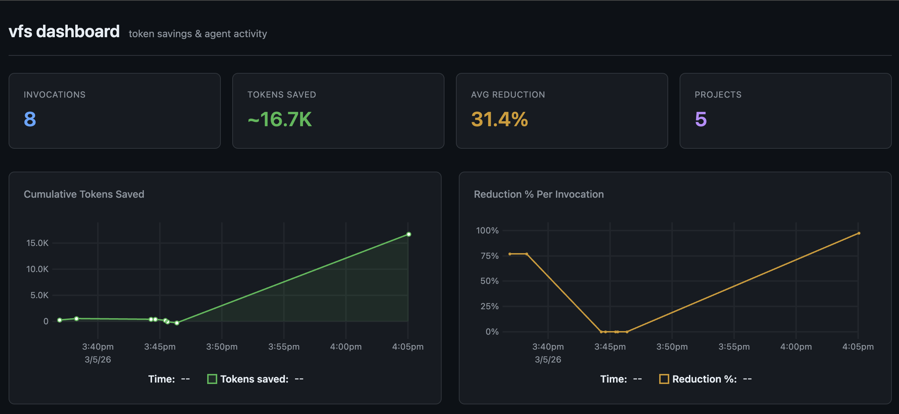

# vfs

**Virtual Function Signatures** -- extract exported function, class, interface, and type signatures from source code with bodies stripped. Designed to reduce token consumption when AI coding agents explore codebases.

> **Platform**: macOS and Linux. Windows is not currently supported (tree-sitter CGO bindings and `vfs up` require Unix syscalls). Windows users can use the [Docker](#docker) image instead.

## Supported Languages

| Language        | Extensions                              | Parser      |
|-----------------|-----------------------------------------|-------------|
| Go              | `.go`                                   | `go/ast`    |
| JavaScript      | `.js`, `.mjs`, `.cjs`, `.jsx`           | tree-sitter |
| TypeScript      | `.ts`, `.mts`, `.cts`, `.tsx`           | tree-sitter |
| Python          | `.py`                                   | tree-sitter |
| Rust            | `.rs`                                   | tree-sitter |
| Java            | `.java`                                 | tree-sitter |
| HCL / Terraform | `.tf`, `.hcl`                           | tree-sitter |
| Dockerfile      | `Dockerfile`, `Dockerfile.*`            | line-based  |
| Protobuf        | `.proto`                                | line-based  |
| SQL             | `.sql`                                  | line-based  |
| YAML            | `.yml`, `.yaml`                         | line-based  |

## Quick Start

```bash
# 1. Install
go install github.com/TrNgTien/vfs/cmd/vfs@latest

# 2. Scan a project
vfs . -f HandleLogin

# 3. Start server + dashboard in background
vfs up

# 4. Open dashboard
open http://localhost:3000

# 5. Check status / stop
vfs status
vfs down
```

## Install

Requires macOS or Linux with Go 1.24+ (CGO enabled for tree-sitter).

```bash
go install github.com/TrNgTien/vfs/cmd/vfs@latest
```

Or build from source:

```bash
git clone https://github.com/TrNgTien/vfs.git
cd vfs
make install                          # build + copy to $GOPATH/bin
make install INSTALL_DIR=~/bin        # or pick your own directory
```

After install, `vfs` is on your PATH and works from any directory.

> No Go installed? See [Docker](#docker) for a container-based alternative that works on any OS.

## CLI Usage

```bash
# Scan entire project
vfs .

# Scan specific directories
vfs ./internal ./pkg ./src

# Filter by pattern (case-insensitive)
vfs . -f HandleLogin

# Single file
vfs handler.go
vfs src/components/App.tsx

# Show token efficiency stats
vfs . --stats

# Combine filter + stats
vfs ./src -f useAuth --stats
```

### Output Format

One signature per line, prefixed with file path:

```
internal/handlers/auth.go: func HandleLogin(c *gin.Context)
internal/handlers/auth.go: func HandleLogout(c *gin.Context)
internal/services/user.go: func NewUserService(repo UserRepo) *UserService
src/components/App.tsx: export function App(props: AppProps)
src/hooks/useAuth.ts: export const useAuth = () => { ... }
app/services/auth.py: class AuthService(BaseService)
app/services/auth.py: def authenticate(self, username: str, password: str) -> bool
```

### Flags

| Flag           | Description                                       |
|----------------|---------------------------------------------------|
| `-f <pattern>` | Case-insensitive substring filter on output lines |
| `--stats`      | Show token efficiency stats after output          |
| `--no-record`  | Skip logging this invocation to history           |

## Server Management

vfs includes a built-in MCP server and a dashboard UI. You can run them together or separately, in the foreground or as a background daemon.

### `vfs up` / `vfs down` / `vfs status` (recommended)

Start the server as a background daemon that survives terminal close:

```bash
$ vfs up
vfs started (pid 12345)
  MCP:       http://localhost:8080/mcp
  dashboard: http://localhost:3000
  log:       ~/.vfs/vfs.log
  stop:      vfs down

$ vfs status
MCP server:  running  (http://localhost:8080/mcp)
Dashboard:   running  (http://localhost:3000/)

$ vfs down
vfs stopped (pid 12345)
```

PID is stored at `~/.vfs/vfs.pid`, logs at `~/.vfs/vfs.log`.

Custom ports:

```bash
vfs up --mcp :9090 --dashboard-port 4000
vfs status --mcp :9090 --dashboard-port 4000
```

### `vfs serve` (foreground)

Run in the current terminal (useful for debugging or watching logs live):

```bash
vfs serve                                    # MCP on :8080, dashboard on :3000
vfs serve --mcp :9090 --dashboard-port 4000  # custom ports
```

### `vfs dashboard` (dashboard only)

```bash
vfs dashboard                 # http://localhost:3000
vfs dashboard --port 4000     # custom port
```

### `vfs mcp` (MCP server only)

For AI assistant integration without the dashboard:

```bash
vfs mcp                       # stdio transport (for Cursor, Claude Desktop)
vfs mcp --http :8080          # HTTP transport (for Docker, remote clients)
```

## Commands Reference

| Command | Description |
|---------|-------------|
| `vfs <path> [-f pattern]` | Scan files/directories for signatures |
| `vfs up` | Start MCP server + dashboard (detached) |
| `vfs down` | Stop the background server |
| `vfs status` | Check if the server is running |
| `vfs serve` | Run MCP server + dashboard (foreground) |
| `vfs mcp` | Run MCP server only (stdio or HTTP) |
| `vfs dashboard` | Run dashboard only |
| `vfs stats` | Show lifetime token savings |
| `vfs stats --reset` | Clear all history |
| `vfs bench` | Run token savings benchmark |

## MCP Server

vfs exposes its capabilities as [MCP](https://modelcontextprotocol.io/) tools that AI assistants can call directly.

### Exposed Tools

| Tool | Description | Parameters |
|------|-------------|------------|
| `extract` | Scan paths and return all exported signatures | `paths` (string[], required) |
| `search` | Extract signatures filtered by name pattern | `paths` (string[], required), `pattern` (string, required) |
| `stats` | Return lifetime usage statistics | none |
| `list_languages` | List supported languages and extensions | none |

### Cursor Configuration

Add to `.cursor/mcp.json` in your project or `~/.cursor/mcp.json` globally:

```json
{
  "mcpServers": {
    "vfs": {
      "command": "vfs",
      "args": ["mcp"]
    }
  }
}
```

### Claude Desktop Configuration

Add to `claude_desktop_config.json`:

```json
{
  "mcpServers": {
    "vfs": {
      "command": "vfs",
      "args": ["mcp"]
    }
  }
}
```

### Docker (HTTP mode)

```json
{
  "mcpServers": {
    "vfs": {
      "url": "http://localhost:8080/mcp"
    }
  }
}
```

## Dashboard

A built-in web UI for visualizing token savings over time.



### How It Works

```
vfs . -f pattern          every scan appends to ~/.vfs/history.jsonl
        │
        ▼
~/.vfs/history.jsonl      append-only, one JSON line per invocation
        │
        ▼
GET /api/history          dashboard reads the file on each request
        │
        ▼
dashboard.html            renders charts, auto-refreshes every 30s
```

Every `vfs` invocation automatically records: timestamp, project path, files scanned, raw bytes, vfs bytes, tokens saved, and reduction %.

### Panels

- **Summary cards**: Total invocations, lifetime tokens saved, average reduction %, number of projects
- **Cumulative Tokens Saved**: Time-series line chart
- **Reduction % Per Invocation**: Scatter chart
- **Agent Activity Heatmap**: Invocations by hour-of-day and day-of-week
- **Tokens Saved by Project**: Horizontal bar chart

### Managing History

```bash
vfs stats                 # view lifetime stats in terminal
vfs stats --reset         # clear all history
```

## Subcommands

### `vfs stats`

```bash
vfs stats          # show lifetime stats
vfs stats --reset  # clear history
```

Output:

```
--- vfs lifetime stats ---
Invocations:         142
Total tokens saved:  ~384,200
Total raw scanned:   12.4 MB  (38,420 lines)
Total vfs output:    892.0 KB  (4,210 lines)
Avg reduction:       92.8%
First recorded:      2026-03-01 10:15
Last recorded:       2026-03-05 14:30
```

### `vfs bench`

Run a 3-way comparison showing how many tokens each approach sends to an LLM:

| Approach | What it does |
|----------|-------------|
| **Read all files** | `cat` every source file -- worst case baseline |
| **grep/rg** | Text search -- what an LLM agent does with Grep tool |
| **vfs** | Structured signatures only -- bodies stripped |

```bash
make bench                                         # quick self-test
vfs bench --self                                   # same thing
vfs bench -f HandleLogin /path/to/go-project       # benchmark on any project
vfs bench -f Login /path/to/project --show-output  # show actual output
```

## Docker

Run vfs in a container -- works on **any OS** with Docker installed (including Windows).

### Build

```bash
docker build -t vfs-mcp .
# or:
make docker-build
```

### Server Mode (default)

Starts MCP server + dashboard:

```bash
docker run --rm -v $(pwd):/workspace -p 8080:8080 -p 3000:3000 vfs-mcp
```

- MCP endpoint: `http://localhost:8080/mcp`
- Dashboard: `http://localhost:3000`

### CLI Mode

Pass any `vfs` arguments after the image name:

```bash
docker run --rm -v $(pwd):/workspace vfs-mcp /workspace -f HandleLogin
docker run --rm -v $(pwd):/workspace vfs-mcp /workspace --stats
docker run --rm vfs-mcp stats
```

### Make Shortcuts

```bash
make docker-run                                    # server mode
make docker-cli ARGS='/workspace -f HandleLogin'   # CLI mode
```

## Make Targets

| Target | Description |
|--------|-------------|
| `make build` | Build binary to `./bin/vfs` |
| `make install` | Build + copy to `$GOPATH/bin` (override with `INSTALL_DIR=`) |
| `make serve` | Build + run MCP server + dashboard (foreground) |
| `make up` | Build + start MCP server + dashboard (detached) |
| `make down` | Stop detached server |
| `make status` | Check if server is running |
| `make dashboard` | Build + run dashboard only on `:3000` |
| `make bench` | Quick self-test benchmark |
| `make bench-on DIR=<path> PATTERN=<name>` | Benchmark on any project |
| `make test` | Run tests |
| `make lint` | Run linter |
| `make docker-build` | Build Docker image |
| `make docker-run` | Run server in Docker |
| `make docker-cli ARGS='...'` | Run CLI in Docker |
| `make clean` | Stop server + remove binary |
| `make help` | Show all targets |

## How It Works

- **Go**: Parses with `go/ast`, walks `FuncDecl` nodes, nils out `Body`, prints with `go/printer`.
- **JS/TS**: Parses with [tree-sitter](https://github.com/tree-sitter/go-tree-sitter) + language grammars, walks `export_statement` nodes, extracts signatures with bodies stripped.
- **Python**: Parses with tree-sitter + `tree-sitter-python`, walks top-level `function_definition`, `class_definition`, `decorated_definition`, and UPPER_CASE constant assignments.
- **Rust**: Parses with tree-sitter + `tree-sitter-rust`, extracts `pub` items (functions, structs, enums, traits, type aliases, consts, statics, modules) and pub methods from `impl` blocks.
- **Java**: Parses with tree-sitter + `tree-sitter-java`, extracts public classes, interfaces, enums, records, annotations, public methods, constructors, and `public static final` constants.
### What Gets Extracted

**Go**: All exported functions and methods (capitalized names).

**JS/TS**: Exported declarations:
- `export function foo()`
- `export default function foo()`
- `export const foo = () => {}`
- `export class Foo`
- `export interface Foo`
- `export type Foo = ...`
- `export enum Foo`
- `export { foo, bar }`

**Python**: Top-level public symbols (no leading `_`):
- `def foo(a, b) -> int`
- `async def fetch(url: str)`
- `class Foo(Base)`
- `@decorator def bar()`
- `FOO = 42` (module-level UPPER_CASE constants)

**Rust**: Top-level `pub` items:
- `pub fn process(data: &[u8]) -> Result<()>`
- `pub struct Config { ... }`
- `pub enum Status { ... }`
- `pub trait Handler { ... }`
- `pub type Result<T> = std::result::Result<T, Error>`
- `impl Server::pub fn start(&self)`

**Java**: Public declarations:
- `public class UserService extends BaseService { ... }`
- `public interface Repository<T> { ... }`
- `public enum Status { ... }`
- `public record Point(int x, int y) { ... }`
- `@Override public void handle(Request req)`
- `public static final String API_KEY = ...`

### Skipped Files/Directories

- `vendor/`, `node_modules/`, `.git/`, `testdata/`, `dist/`, `build/`, `.next/`
- `__pycache__/`, `.venv/`, `venv/`, `.tox/`, `.terraform/`
- `target/` (Rust)
- `*_test.go`, `*.test.*`, `*.spec.*`, `*.d.ts`, `*.min.*`
- `test_*.py`, `*_test.py`, `conftest.py`
- `*Test.java`, `*Tests.java`

## Project Layout

```
cmd/vfs/
  main.go           CLI entry point
  root.go           Root command (scan paths, filter, record stats)
  mcp.go            MCP server (tool handlers, stdio/HTTP transport)
  serve.go          Combined MCP server + dashboard in one process
  up.go             Detached server lifecycle (up / down)
  status.go         Server health check (probes HTTP endpoints)
  dashboard.go      Dashboard HTTP server + API
  dashboard.html    Embedded SPA (dark theme, uPlot charts)
  bench.go          Token savings benchmark
  stats.go          Lifetime stats viewer + reset
internal/
  parser/
    registry.go     Parser registration and extension matching
    types.go        Shared types (Stats, FileResult, ComputeStats)
    walker.go       Language-agnostic directory walker
    goparser/       Go parser (go/ast)
    tsparser/       JS/TS parser (tree-sitter)
    pyparser/       Python parser (tree-sitter)
    rustparser/     Rust parser (tree-sitter)
    javaparser/     Java parser (tree-sitter)
    hclparser/      HCL/Terraform parser (tree-sitter)
    dockerparser/   Dockerfile parser (line-based)
    protoparser/    Protocol Buffers parser (line-based)
    sqlparser/      SQL DDL parser (line-based)
  stats/            Performance history tracking (~/.vfs/history.jsonl)
pkg/
  bench/            Side-by-side benchmark (grep/rg vs vfs)
Dockerfile          Multi-stage build (binary + MCP server)
entrypoint.sh       Docker entrypoint (server mode or CLI passthrough)
AGENTS.md           Agent integration guide (any AI agent)
```

## Cursor Integration

A Cursor rule at `.cursor/rules/vfs-go-search.mdc` instructs the AI agent to use `vfs` instead of `grep`/`rg` when searching for function signatures. Copy this rule to other projects or add `vfs` instructions to your workspace `CLAUDE.md`.

For any AI agent, see [AGENTS.md](AGENTS.md).

## License

MIT
