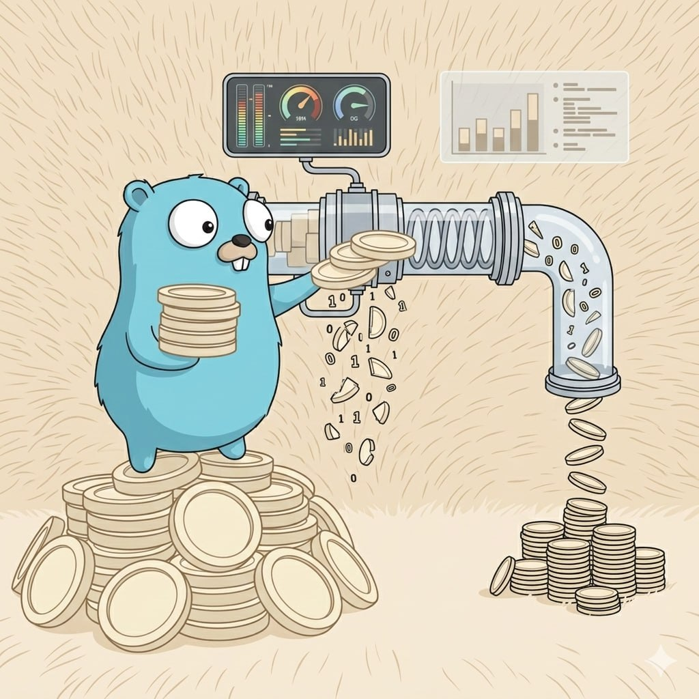

<p align="center">
  
</p>

# vfs

**Virtual Function Signatures** -- extract exported function, class, interface, and type signatures from source code with bodies stripped.

## Table of Contents

- [vfs](#vfs)
  - [Table of Contents](#table-of-contents)
  - [Why vfs?](#why-vfs)
    - [How agents use it](#how-agents-use-it)
  - [Benchmark](#benchmark)
  - [Security \& Privacy](#security--privacy)
  - [Supported Languages](#supported-languages)
  - [Quick Start](#quick-start)
  - [Install](#install)
    - [Prerequisites](#prerequisites)
    - [From source (recommended)](#from-source-recommended)
    - [Via `go install`](#via-go-install)
    - [Cross-compile for Windows (from macOS/Linux)](#cross-compile-for-windows-from-macoslinux)
    - [Troubleshooting](#troubleshooting)
  - [Windows Guide](#windows-guide)
    - [Option A: Native Install (recommended)](#option-a-native-install-recommended)
    - [Option B: Docker (no C compiler needed)](#option-b-docker-no-c-compiler-needed)
    - [Option C: WSL (Windows Subsystem for Linux)](#option-c-wsl-windows-subsystem-for-linux)
    - [MCP Setup on Windows](#mcp-setup-on-windows)
    - [Windows Troubleshooting](#windows-troubleshooting)
  - [CLI Usage](#cli-usage)
    - [Output Format](#output-format)
    - [Flags](#flags)
  - [Server Management](#server-management)
    - [`vfs up` / `vfs down` / `vfs status` (recommended)](#vfs-up--vfs-down--vfs-status-recommended)
    - [`vfs serve` (foreground)](#vfs-serve-foreground)
    - [`vfs dashboard` (dashboard only)](#vfs-dashboard-dashboard-only)
    - [`vfs mcp` (MCP server only)](#vfs-mcp-mcp-server-only)
  - [Commands Reference](#commands-reference)
  - [MCP Server](#mcp-server)
    - [Exposed Tools](#exposed-tools)
    - [Cursor Configuration](#cursor-configuration)
    - [Claude Desktop Configuration](#claude-desktop-configuration)
    - [Docker (HTTP mode)](#docker-http-mode)
  - [Dashboard](#dashboard)
    - [How It Works](#how-it-works)
    - [Panels](#panels)
    - [Managing History](#managing-history)
  - [Subcommands](#subcommands)
    - [`vfs stats`](#vfs-stats)
    - [`vfs bench`](#vfs-bench)
  - [Docker](#docker)
    - [Build](#build)
    - [Server Mode (default)](#server-mode-default)
    - [CLI Mode](#cli-mode)
    - [Make Shortcuts](#make-shortcuts)
  - [Make Targets](#make-targets)
  - [How It Works](#how-it-works-1)
    - [What Gets Extracted](#what-gets-extracted)
    - [Skipped Files/Directories](#skipped-filesdirectories)
  - [Project Layout](#project-layout)
  - [Cursor Integration](#cursor-integration)
  - [License](#license)

## Why vfs?

When AI coding agents (Cursor, Claude Code, Copilot, etc.) explore a codebase, they typically `grep` for patterns, `cat` entire files, or run semantic search -- all of which send large amounts of irrelevant code to the LLM. Function bodies, implementation details, and boilerplate dilute the context window, waste tokens, and slow down responses.

vfs solves this by parsing source files via AST and tree-sitter grammars, extracting only the **exported signatures** (functions, classes, types, interfaces) with bodies stripped. This gives the agent a compact "table of contents" of any codebase -- enough to understand the API surface and navigate to the right file and line, without the noise.

**The result**: 60-70% fewer tokens per code search, faster agent responses, and less distraction from irrelevant implementation details.

### How agents use it

1. A [cursor rule](.cursor/rules/vfs-go-search.mdc) or [AGENTS.md](AGENTS.md) instructs the AI agent to call `vfs` instead of grep/cat when searching for function definitions.
2. The agent calls vfs via **MCP tools** (preferred -- works in sandboxed environments like Cursor and Claude Code) or the CLI.
3. vfs returns compact signatures like `func HandleLogin(c *gin.Context)` with file paths and line numbers.
4. The agent reads only the specific lines it needs, instead of entire files.

## Benchmark

Self-benchmark on this repository (pattern `"Extract"`, 4,178 lines of source):

|                 | Read all files | grep       | vfs        |
|-----------------|----------------|------------|------------|
| Output size     | 101.9 KB       | 13.8 KB    | 1.5 KB     |
| Lines           | 4,178          | 148        | 15         |
| Est. tokens     | 26,079         | 3,537      | 373        |

- **vfs saves 98.6% tokens** vs reading all files (26,079 -> 373)
- **vfs saves 89.5% tokens** vs grep (3,537 -> 373)

| Approach | What it does |
|----------|-------------|
| **Read all files** | `cat` every source file -- worst case baseline |
| **grep/rg** | Text search -- what an LLM agent does with Grep tool |
| **vfs** | Structured signatures only -- bodies stripped |

Run it yourself:

```bash
make bench                                         # quick self-test
vfs bench --self                                   # same thing
vfs bench -f HandleLogin /path/to/go-project       # benchmark on any project
vfs bench -f Login /path/to/project --show-output  # show actual output
```

## Security & Privacy

> **Local-first by design.** vfs is built on the principle that your source code should never leave your machine. There is no server, no telemetry, no account, and no network dependency.

- **Zero network access** -- all parsing is done locally via AST and tree-sitter. vfs makes no outbound connections, ever.
- **No secrets exposure** -- vfs does not read, access, or store API keys, credentials, tokens, or environment variables.
- **No data collection** -- no telemetry, no analytics, no tracking. Nothing is sent anywhere.
- **No code storage** -- your source code is parsed in memory and discarded. The only file vfs writes is `~/.vfs/history.jsonl`, a local append-only log of scan statistics (file counts, byte sizes, token savings). No source code is stored.
- **Fully offline** -- works without an internet connection. Install once, use forever.

> **Platform**: macOS, Linux, and Windows. All platforms require CGO and a C compiler (see [Install](#install)).

## Supported Languages

| Language        | Extensions                              | Parser      |
|-----------------|-----------------------------------------|-------------|
| Go              | `.go`                                   | `go/ast`    |
| JavaScript      | `.js`, `.mjs`, `.cjs`, `.jsx`           | tree-sitter |
| TypeScript      | `.ts`, `.mts`, `.cts`, `.tsx`           | tree-sitter |
| Python          | `.py`                                   | tree-sitter |
| Rust            | `.rs`                                   | tree-sitter |
| Java            | `.java`                                 | tree-sitter |
| HCL / Terraform | `.tf`, `.hcl`                           | tree-sitter |
| Dockerfile      | `Dockerfile`, `Dockerfile.*`            | line-based  |
| Protobuf        | `.proto`                                | line-based  |
| SQL             | `.sql`                                  | line-based  |
| YAML            | `.yml`, `.yaml`                         | line-based  |

## Quick Start

**macOS / Linux:**

```bash
# 1. Install (from source -- includes pre-flight checks)
git clone https://github.com/TrNgTien/vfs.git && cd vfs
make install

# 2. Scan a project
vfs . -f HandleLogin

# 3. Start server + dashboard in background
vfs up

# 4. Open dashboard
open http://localhost:3000

# 5. Check status / stop
vfs status
vfs down
```

**Windows** (Git Bash, MSYS2, or PowerShell):

```bash
# 1. Install (from Git Bash or MSYS2 -- includes pre-flight checks)
git clone https://github.com/TrNgTien/vfs.git && cd vfs
make install

# 2. Scan a project
vfs . -f HandleLogin

# 3. Start server + dashboard in background
vfs up

# 4. Open dashboard
start http://localhost:3000

# 5. Check status / stop
vfs status
vfs down
```

> **Windows users**: see the full [Windows Guide](#windows-guide) for prerequisites, shell setup, and troubleshooting.

## Install

### Prerequisites

vfs uses [tree-sitter](https://github.com/tree-sitter/go-tree-sitter) C bindings, so you need:

- **Go 1.24+** with CGO enabled (the default)
- **A C compiler** -- `cc`, `gcc`, or `clang`

On **macOS**, the C compiler comes from Xcode Command Line Tools:

```bash
xcode-select --install          # install if missing
sudo xcodebuild -license accept # accept license if prompted
```

On **Linux**: `apt install build-essential` (Debian/Ubuntu) or `yum groupinstall "Development Tools"` (RHEL/Fedora).

On **Windows**: install [MSYS2](https://www.msys2.org/) and the MinGW-w64 toolchain:

```bash
# Inside MSYS2 terminal
pacman -S mingw-w64-x86_64-gcc
```

Then add `C:\msys64\mingw64\bin` to your `PATH`. Alternatively, use [TDM-GCC](https://jmeubank.github.io/tdm-gcc/) or build via WSL.

### From source (recommended)

Works on macOS, Linux, and Windows. The Makefile auto-detects the host OS.

```bash
git clone https://github.com/TrNgTien/vfs.git
cd vfs
make install                          # build + copy to $GOPATH/bin
make install INSTALL_DIR=~/bin        # or pick your own directory
```

`make install` automatically stops any running vfs process, removes the old binary, and installs the new one. It also runs pre-flight checks and tells you exactly what's missing if the build can't proceed.

On **Windows**, run `make` from Git Bash, MSYS2, or any POSIX-compatible shell. The Makefile uses `go env GOOS` to detect Windows and adjusts commands accordingly (produces `vfs.exe`, uses `taskkill` instead of `pkill`, etc.).

### Via `go install`

```bash
go install github.com/TrNgTien/vfs/cmd/vfs@latest
```

> **Note**: `go install` requires a working C compiler because of CGO. If you see errors about `operation not permitted` or Xcode license, install/accept Xcode Command Line Tools first (see [Prerequisites](#prerequisites)), then retry.

After install, `vfs` is on your PATH and works from any directory.

> No Go installed? See [Docker](#docker) for a container-based alternative that works on any OS.

### Cross-compile for Windows (from macOS/Linux)

If you're on macOS or Linux and want to produce a Windows binary:

```bash
# Install the cross-compiler
# macOS:  brew install mingw-w64
# Linux:  apt install gcc-mingw-w64-x86-64

make build-windows   # produces bin/vfs.exe
```

### Troubleshooting

| Error | Fix |
|-------|-----|
| `operation not permitted` (sandbox) | Run outside the sandbox, or use `make install` from a cloned repo |
| `xcodebuild: error: ... license` | `sudo xcodebuild -license accept` |
| `xcrun: error: ... command line tools` | `xcode-select --install` |
| `CGO_ENABLED=0` / `cgo: C compiler not found` | Install a C compiler (see [Prerequisites](#prerequisites)) |
| `gcc: error: unrecognized option` (Windows) | Ensure MinGW-w64 `gcc` is on PATH, not MSVC `cl.exe` |
| `command not found` inside AI agent sandbox | The agent runs in a sandbox without access to host binaries. Configure the [MCP server](#mcp-server) instead -- MCP tools run on the host outside the sandbox |

## Windows Guide

A complete walkthrough for Windows users -- from zero to running vfs with AI agents.

### Option A: Native Install (recommended)

#### 1. Install a C compiler

vfs requires CGO (tree-sitter C bindings). Pick **one** of these:

**MSYS2 + MinGW-w64** (recommended):

1. Download and install [MSYS2](https://www.msys2.org/).
2. Open the **MSYS2 UCRT64** terminal and run:

```bash
pacman -S mingw-w64-x86_64-gcc
```

3. Add `C:\msys64\mingw64\bin` to your system `PATH`:
   - Open **Settings > System > About > Advanced system settings > Environment Variables**
   - Under **System variables**, select `Path`, click **Edit**, and add `C:\msys64\mingw64\bin`
4. Verify in a **new** terminal:

```
gcc --version
```

**TDM-GCC** (simpler, fewer features):

1. Download from [jmeubank.github.io/tdm-gcc](https://jmeubank.github.io/tdm-gcc/).
2. Run the installer -- it adds itself to PATH automatically.

#### 2. Install Go

Download Go 1.24+ from [go.dev/dl](https://go.dev/dl/) and run the `.msi` installer. Verify:

```
go version
```

#### 3. Install vfs

**From source** (Git Bash or MSYS2 terminal):

```bash
git clone https://github.com/TrNgTien/vfs.git
cd vfs
make install
```

This produces `vfs.exe` and copies it to `%GOPATH%\bin`. The Makefile auto-detects Windows and uses `taskkill` instead of `pkill`, etc.

**Via `go install`** (any terminal):

```
go install github.com/TrNgTien/vfs/cmd/vfs@latest
```

After install, verify:

```
vfs --help
```

> If `vfs` is not found, ensure `%GOPATH%\bin` (usually `%USERPROFILE%\go\bin`) is on your PATH.

#### 4. Use vfs

All CLI commands work the same on Windows:

```bash
vfs . -f HandleLogin          # scan current project
vfs .\src -f useAuth          # scan a subdirectory (backslash or forward slash)
vfs ./src -f useAuth          # forward slashes also work
vfs handler.go                # single file
vfs . --stats                 # show token savings
```

#### 5. Start the server

```bash
vfs up                        # background daemon (MCP + dashboard)
vfs status                    # check if running
start http://localhost:3000   # open dashboard in browser
vfs down                      # stop
```

On Windows, `vfs up` uses `CREATE_NEW_PROCESS_GROUP` to detach the server process. PID is stored at `%USERPROFILE%\.vfs\vfs.pid`, logs at `%USERPROFILE%\.vfs\vfs.log`.

### Option B: Docker (no C compiler needed)

If you don't want to install Go or a C compiler, use Docker:

```powershell
# PowerShell
docker build -t vfs-mcp .
docker run --rm -v ${PWD}:/workspace -p 8080:8080 -p 3000:3000 vfs-mcp
```

```bash
# Git Bash / MSYS2
docker run --rm -v "$(pwd)":/workspace -p 8080:8080 -p 3000:3000 vfs-mcp
```

```cmd
# Command Prompt
docker run --rm -v %cd%:/workspace -p 8080:8080 -p 3000:3000 vfs-mcp
```

Then configure your editor to use the HTTP MCP endpoint:

```json
{
  "mcpServers": {
    "vfs": {
      "url": "http://localhost:8080/mcp"
    }
  }
}
```

### Option C: WSL (Windows Subsystem for Linux)

If you already use WSL, install vfs inside your Linux distro -- it works exactly like the Linux instructions:

```bash
sudo apt install build-essential   # C compiler
# install Go 1.24+ if not already present
git clone https://github.com/TrNgTien/vfs.git && cd vfs
make install
```

> **Note**: If your editor (Cursor, VS Code) opens projects from the Windows filesystem (`/mnt/c/...`), vfs inside WSL can still scan them. For MCP, configure the stdio transport pointing to the WSL binary, or use `vfs mcp --http :8080` and connect from the Windows side.

### MCP Setup on Windows

For AI agent integration, configure the MCP server in your editor:

**Cursor** -- add to `.cursor\mcp.json` in your project or `%USERPROFILE%\.cursor\mcp.json` globally:

```json
{
  "mcpServers": {
    "vfs": {
      "command": "vfs",
      "args": ["mcp"]
    }
  }
}
```

> On Windows, Cursor resolves `"command": "vfs"` to `vfs.exe` on your PATH automatically.

**Claude Desktop** -- add to `%APPDATA%\Claude\claude_desktop_config.json`:

```json
{
  "mcpServers": {
    "vfs": {
      "command": "vfs",
      "args": ["mcp"]
    }
  }
}
```

### Windows Troubleshooting

| Error | Fix |
|-------|-----|
| `gcc: command not found` | Install MinGW-w64 or TDM-GCC and add to PATH (see step 1 above) |
| `gcc: error: unrecognized option` | Ensure MinGW-w64 `gcc` is on PATH, not MSVC `cl.exe` |
| `vfs: command not found` | Add `%GOPATH%\bin` (usually `%USERPROFILE%\go\bin`) to your PATH |
| `make: command not found` | Run from Git Bash or MSYS2, or install `make` via `choco install make` |
| `taskkill` errors during install | Normal if no previous vfs process was running -- the install still succeeds |
| MCP not connecting in Cursor | Ensure `vfs.exe` is on PATH. Test with `vfs mcp` in a terminal first |
| Slow first build | Expected -- tree-sitter C compilation takes 1-2 minutes on first build, subsequent builds are cached |

## CLI Usage

```bash
# Scan entire project
vfs .

# Scan specific directories
vfs ./internal ./pkg ./src

# Filter by pattern (case-insensitive)
vfs . -f HandleLogin

# Single file
vfs handler.go
vfs src/components/App.tsx

# Show token efficiency stats
vfs . --stats

# Combine filter + stats
vfs ./src -f useAuth --stats
```

### Output Format

One signature per line, prefixed with file path:

```
internal/handlers/auth.go: func HandleLogin(c *gin.Context)
internal/handlers/auth.go: func HandleLogout(c *gin.Context)
internal/services/user.go: func NewUserService(repo UserRepo) *UserService
src/components/App.tsx: export function App(props: AppProps)
src/hooks/useAuth.ts: export const useAuth = () => { ... }
app/services/auth.py: class AuthService(BaseService)
app/services/auth.py: def authenticate(self, username: str, password: str) -> bool
```

### Flags

| Flag           | Description                                       |
|----------------|---------------------------------------------------|
| `-f <pattern>` | Case-insensitive substring filter on output lines |
| `--stats`      | Show token efficiency stats after output          |
| `--no-record`  | Skip logging this invocation to history           |

## Server Management

vfs includes a built-in MCP server and a dashboard UI. You can run them together or separately, in the foreground or as a background daemon.

### `vfs up` / `vfs down` / `vfs status` (recommended)

Start the server as a background daemon that survives terminal close:

```bash
$ vfs up
vfs started (pid 12345)
  MCP:       http://localhost:8080/mcp
  dashboard: http://localhost:3000
  log:       ~/.vfs/vfs.log
  stop:      vfs down

$ vfs status
MCP server:  running  (http://localhost:8080/mcp)
Dashboard:   running  (http://localhost:3000/)

$ vfs down
vfs stopped (pid 12345)
```

PID is stored at `~/.vfs/vfs.pid`, logs at `~/.vfs/vfs.log`.

Custom ports:

```bash
vfs up --mcp :9090 --dashboard-port 4000
vfs status --mcp :9090 --dashboard-port 4000
```

### `vfs serve` (foreground)

Run in the current terminal (useful for debugging or watching logs live):

```bash
vfs serve                                    # MCP on :8080, dashboard on :3000
vfs serve --mcp :9090 --dashboard-port 4000  # custom ports
```

### `vfs dashboard` (dashboard only)

```bash
vfs dashboard                 # http://localhost:3000
vfs dashboard --port 4000     # custom port
```

### `vfs mcp` (MCP server only)

For AI assistant integration without the dashboard:

```bash
vfs mcp                       # stdio transport (for Cursor, Claude Desktop)
vfs mcp --http :8080          # HTTP transport (for Docker, remote clients)
```

## Commands Reference

| Command | Description |
|---------|-------------|
| `vfs <path> [-f pattern]` | Scan files/directories for signatures |
| `vfs up` | Start MCP server + dashboard (detached) |
| `vfs down` | Stop the background server |
| `vfs status` | Check if the server is running |
| `vfs serve` | Run MCP server + dashboard (foreground) |
| `vfs mcp` | Run MCP server only (stdio or HTTP) |
| `vfs dashboard` | Run dashboard only |
| `vfs stats` | Show lifetime token savings |
| `vfs stats --reset` | Clear all history |
| `vfs bench` | Run token savings benchmark |

## MCP Server

vfs exposes its capabilities as [MCP](https://modelcontextprotocol.io/) tools that AI assistants can call directly.

> **Why MCP matters for sandboxed agents**: AI coding agents in Cursor, Claude Code, and similar editors often run inside a sandbox that blocks access to host-installed binaries. The `vfs` CLI won't be found even if it's installed on your machine. MCP tools run **outside** the sandbox on the host, so the agent can call `search`, `extract`, etc. without needing direct access to the binary. **If you use an AI coding agent, configuring the MCP server is the recommended setup.**

### Exposed Tools

| Tool | Description | Parameters |
|------|-------------|------------|
| `extract` | Scan paths and return all exported signatures | `paths` (string[], required) |
| `search` | Extract signatures filtered by name pattern | `paths` (string[], required), `pattern` (string, required) |
| `stats` | Return lifetime usage statistics | none |
| `list_languages` | List supported languages and extensions | none |

### Cursor Configuration

Add to `.cursor/mcp.json` in your project or globally at:
- **macOS/Linux**: `~/.cursor/mcp.json`
- **Windows**: `%USERPROFILE%\.cursor\mcp.json`

```json
{
  "mcpServers": {
    "vfs": {
      "command": "vfs",
      "args": ["mcp"]
    }
  }
}
```

> On Windows, Cursor resolves `"command": "vfs"` to `vfs.exe` on your PATH automatically.

### Claude Desktop Configuration

Add to `claude_desktop_config.json`:
- **macOS**: `~/Library/Application Support/Claude/claude_desktop_config.json`
- **Windows**: `%APPDATA%\Claude\claude_desktop_config.json`

```json
{
  "mcpServers": {
    "vfs": {
      "command": "vfs",
      "args": ["mcp"]
    }
  }
}
```

### Docker (HTTP mode)

```json
{
  "mcpServers": {
    "vfs": {
      "url": "http://localhost:8080/mcp"
    }
  }
}
```

## Dashboard

A built-in web UI for visualizing token savings over time.


### How It Works

```
vfs . -f pattern          every scan appends to ~/.vfs/history.jsonl
        │
        ▼
~/.vfs/history.jsonl      append-only, one JSON line per invocation
        │
        ▼
GET /api/history          dashboard reads the file on each request
        │
        ▼
dashboard.html            renders charts, auto-refreshes every 30s
```

Every `vfs` invocation automatically records: timestamp, project path, files scanned, raw bytes, vfs bytes, tokens saved, and reduction %.

### Panels

- **Summary cards**: Total invocations, lifetime tokens saved, average reduction %, number of projects
- **Cumulative Tokens Saved**: Time-series line chart
- **Reduction % Per Invocation**: Scatter chart
- **Agent Activity Heatmap**: Invocations by hour-of-day and day-of-week
- **Tokens Saved by Project**: Horizontal bar chart

### Managing History

```bash
vfs stats                 # view lifetime stats in terminal
vfs stats --reset         # clear all history
```

## Subcommands

### `vfs stats`

```bash
vfs stats          # show lifetime stats
vfs stats --reset  # clear history
```

Output:

```
--- vfs lifetime stats ---
Invocations:         142
Total tokens saved:  ~384,200
Total raw scanned:   12.4 MB  (38,420 lines)
Total vfs output:    892.0 KB  (4,210 lines)
Avg reduction:       92.8%
First recorded:      2026-03-01 10:15
Last recorded:       2026-03-05 14:30
```

### `vfs bench`

See [Benchmark](#benchmark) for results. Run it yourself:

```bash
vfs bench --self                                   # self-test on vfs source
vfs bench -f HandleLogin /path/to/go-project       # benchmark on any project
vfs bench -f Login /path/to/project --show-output  # show actual output
```

## Docker

Run vfs in a container -- works on **any OS** with Docker installed (including Windows).

### Build

```bash
docker build -t vfs-mcp .
# or:
make docker-build
```

### Server Mode (default)

Starts MCP server + dashboard:

```bash
# macOS / Linux / Git Bash
docker run --rm -v $(pwd):/workspace -p 8080:8080 -p 3000:3000 vfs-mcp

# Windows PowerShell
docker run --rm -v ${PWD}:/workspace -p 8080:8080 -p 3000:3000 vfs-mcp

# Windows Command Prompt
docker run --rm -v %cd%:/workspace -p 8080:8080 -p 3000:3000 vfs-mcp
```

- MCP endpoint: `http://localhost:8080/mcp`
- Dashboard: `http://localhost:3000`

### CLI Mode

Pass any `vfs` arguments after the image name:

```bash
# macOS / Linux / Git Bash
docker run --rm -v $(pwd):/workspace vfs-mcp /workspace -f HandleLogin
docker run --rm -v $(pwd):/workspace vfs-mcp /workspace --stats

# Windows PowerShell
docker run --rm -v ${PWD}:/workspace vfs-mcp /workspace -f HandleLogin

# Windows Command Prompt
docker run --rm -v %cd%:/workspace vfs-mcp /workspace -f HandleLogin
```

### Make Shortcuts

```bash
make docker-run                                    # server mode
make docker-cli ARGS='/workspace -f HandleLogin'   # CLI mode
```

## Make Targets

| Target | Description |
|--------|-------------|
| `make preflight` | Check Go version, CGO, and C compiler availability |
| `make build` | Pre-flight check + build binary (`vfs` on Unix, `vfs.exe` on Windows) |
| `make build-windows` | Cross-compile Windows binary to `./bin/vfs.exe` from macOS/Linux (requires mingw-w64) |
| `make install` | Build + stop running vfs + copy to `$GOPATH/bin` (override with `INSTALL_DIR=`) |
| `make serve` | Build + run MCP server + dashboard (foreground) |
| `make up` | Build + start MCP server + dashboard (detached) |
| `make down` | Stop detached server |
| `make status` | Check if server is running |
| `make dashboard` | Build + run dashboard only on `:3000` |
| `make bench` | Quick self-test benchmark |
| `make bench-on DIR=<path> PATTERN=<name>` | Benchmark on any project |
| `make test` | Run tests |
| `make lint` | Run linter |
| `make docker-build` | Build Docker image |
| `make docker-run` | Run server in Docker |
| `make docker-cli ARGS='...'` | Run CLI in Docker |
| `make clean` | Stop server + remove binary |
| `make help` | Show all targets |

## How It Works

- **Go**: Parses with `go/ast`, walks `FuncDecl` nodes, nils out `Body`, prints with `go/printer`.
- **JS/TS**: Parses with [tree-sitter](https://github.com/tree-sitter/go-tree-sitter) + language grammars, walks `export_statement` nodes, extracts signatures with bodies stripped.
- **Python**: Parses with tree-sitter + `tree-sitter-python`, walks top-level `function_definition`, `class_definition`, `decorated_definition`, and UPPER_CASE constant assignments.
- **Rust**: Parses with tree-sitter + `tree-sitter-rust`, extracts `pub` items (functions, structs, enums, traits, type aliases, consts, statics, modules) and pub methods from `impl` blocks.
- **Java**: Parses with tree-sitter + `tree-sitter-java`, extracts public classes, interfaces, enums, records, annotations, public methods, constructors, and `public static final` constants.


### What Gets Extracted

**Go**: All exported functions and methods (capitalized names).

**JS/TS**: Exported declarations:
- `export function foo()`
- `export default function foo()`
- `export const foo = () => {}`
- `export class Foo`
- `export interface Foo`
- `export type Foo = ...`
- `export enum Foo`
- `export { foo, bar }`

**Python**: Top-level public symbols (no leading `_`):
- `def foo(a, b) -> int`
- `async def fetch(url: str)`
- `class Foo(Base)`
- `@decorator def bar()`
- `FOO = 42` (module-level UPPER_CASE constants)

**Rust**: Top-level `pub` items:
- `pub fn process(data: &[u8]) -> Result<()>`
- `pub struct Config { ... }`
- `pub enum Status { ... }`
- `pub trait Handler { ... }`
- `pub type Result<T> = std::result::Result<T, Error>`
- `impl Server::pub fn start(&self)`

**Java**: Public declarations:
- `public class UserService extends BaseService { ... }`
- `public interface Repository<T> { ... }`
- `public enum Status { ... }`
- `public record Point(int x, int y) { ... }`
- `@Override public void handle(Request req)`
- `public static final String API_KEY = ...`

### Skipped Files/Directories

- `vendor/`, `node_modules/`, `.git/`, `testdata/`, `dist/`, `build/`, `.next/`
- `__pycache__/`, `.venv/`, `venv/`, `.tox/`, `.terraform/`
- `target/` (Rust)
- `*_test.go`, `*.test.*`, `*.spec.*`, `*.d.ts`, `*.min.*`
- `test_*.py`, `*_test.py`, `conftest.py`
- `*Test.java`, `*Tests.java`

## Project Layout

```
cmd/vfs/
  main.go           CLI entry point
  root.go           Root command (scan paths, filter, record stats)
  mcp.go            MCP server (tool handlers, stdio/HTTP transport)
  serve.go          Combined MCP server + dashboard in one process
  up.go             Detached server lifecycle (up / down)
  proc_unix.go      Unix process management (signals, setsid)
  proc_windows.go   Windows process management (kernel32, CREATE_NEW_PROCESS_GROUP)
  status.go         Server health check (probes HTTP endpoints)
  dashboard.go      Dashboard HTTP server + API
  dashboard.html    Embedded SPA (dark theme, uPlot charts)
  bench.go          Token savings benchmark
  stats.go          Lifetime stats viewer + reset
internal/
  parser/
    registry.go     Parser registration and extension matching
    types.go        Shared types (Stats, FileResult, ComputeStats)
    walker.go       Language-agnostic directory walker
    goparser/       Go parser (go/ast)
    tsparser/       JS/TS parser (tree-sitter)
    pyparser/       Python parser (tree-sitter)
    rustparser/     Rust parser (tree-sitter)
    javaparser/     Java parser (tree-sitter)
    hclparser/      HCL/Terraform parser (tree-sitter)
    dockerparser/   Dockerfile parser (line-based)
    protoparser/    Protocol Buffers parser (line-based)
    sqlparser/      SQL DDL parser (line-based)
  stats/            Performance history tracking (~/.vfs/history.jsonl)
pkg/
  bench/            Side-by-side benchmark (grep/rg vs vfs)
Dockerfile          Multi-stage build (binary + MCP server)
entrypoint.sh       Docker entrypoint (server mode or CLI passthrough)
AGENTS.md           Agent integration guide (any AI agent)
```

## Cursor Integration

A Cursor rule at `.cursor/rules/vfs-go-search.mdc` instructs the AI agent to use `vfs` instead of `grep`/`rg` when searching for function signatures. Copy this rule to other projects or add `vfs` instructions to your workspace `CLAUDE.md`.

> **Sandbox note**: Cursor agents run in a sandbox that cannot access host binaries. The `vfs` CLI will not work from inside the agent's shell. To use vfs with Cursor, **configure the MCP server** (see [Cursor Configuration](#cursor-configuration)) -- MCP tools run on the host and are accessible to the agent regardless of sandbox restrictions.

For any AI agent, see [AGENTS.md](AGENTS.md).

## License

MIT
